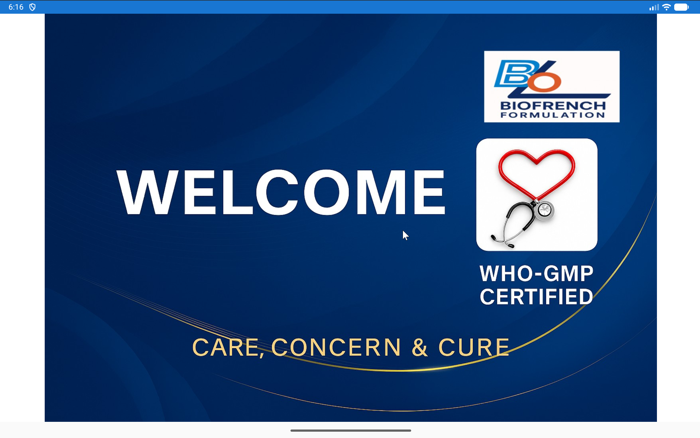
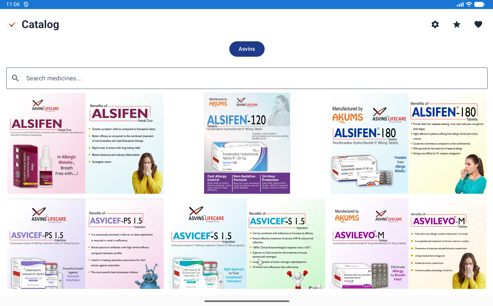
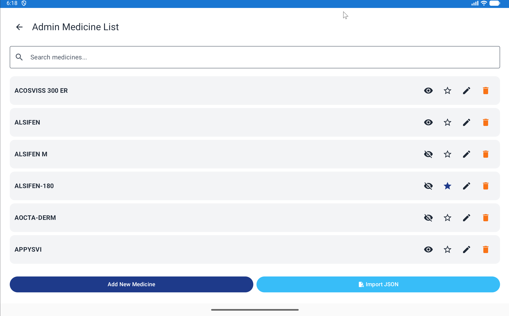
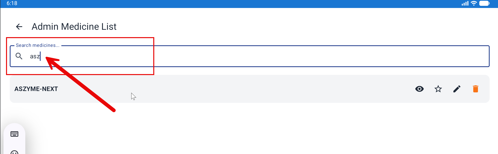
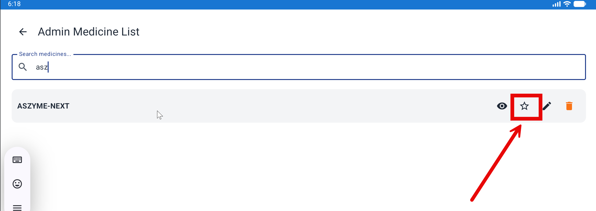
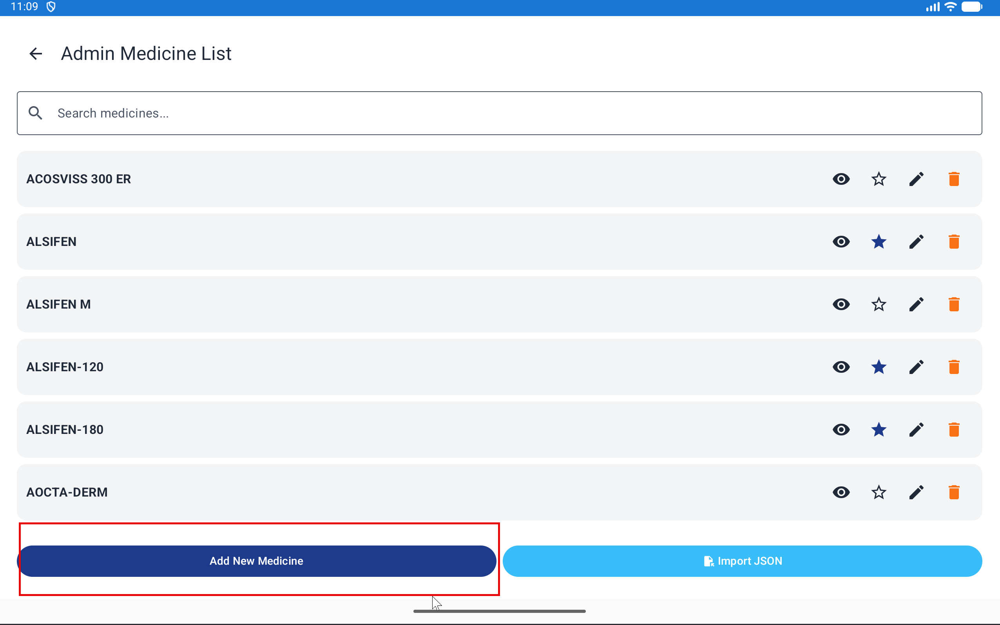
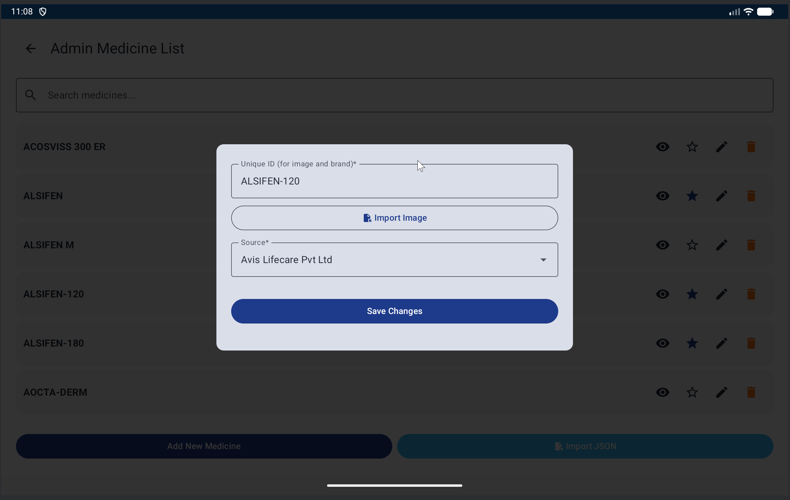
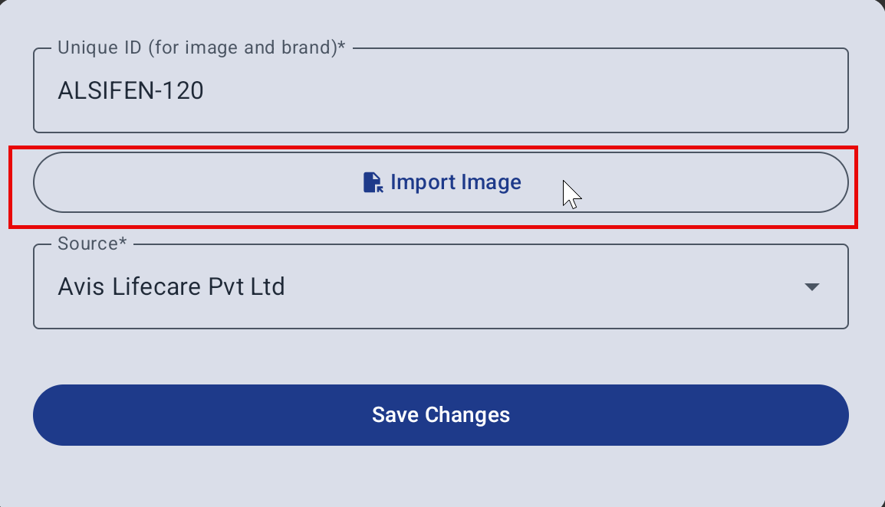
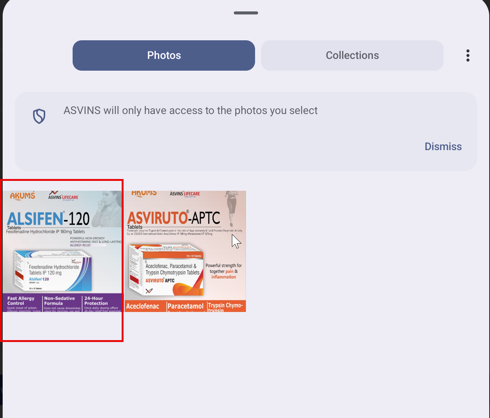

# BioFrench Documentation (Combined)

Generated on: 2026-05-16 23:34

---
# App UI Introduction (User Guide)

Quick overview of the main screens in the Biofrench app and what you can do on each one.

---

## 1) Home

Use **Home** to access the main entry points of the app and quickly navigate to the catalogs and **Settings**.

---

## 2) Catalog (Biofrench)

Use **Catalog Biofrench** to browse the Biofrench product catalog.

### Top bar icons

- **Star (⭐) — Show/Hide the “Other” tab**
  - **What it does:** Enables or disables the **Other** source/tab.
  - **What “Other” contains:** Items that are **not** in the main **Biofrench** catalog and **not** in the **Affiliate** catalog (the remaining ~300 medicines).
  - **How to use it:** Tap the **Star** icon once to show the **Other** tab, tap again to hide it.

- **Heart (❤️) — Thank You**
  - **What it does:** Opens the **Thank You** screen.
  - **How to use it:** Tap the **Heart** icon at any time.

### Using the catalog

- **Switch source:** Use **Biofrench** / **Affiliate** (and **Other** if enabled) to filter the catalog.
- **Search:** Use the search box to find medicines by name.
- **View an item:** Tap a medicine tile to open the image in full screen.
  - In full screen, **swipe left/right** to move between items.
  - Tap **X (Close)** to exit full screen.

---

## 3) Catalog (Affiliate)

Use **Catalog Affiliate** to browse the affiliate catalog.

- Tap **Affiliate** to view affiliate items.
- Tap an item to open it in full screen.

---

## 4) Settings

Use **Settings** to manage your app preferences and configuration.

- Review and update available settings.

---

## 5) Thank You

The **Thank You** screen is shown when you open it from the catalog (heart icon) or after completing a flow in the app.

- Confirm your action is complete.
- Return to the app to continue browsing.

# Import medicines from a JSON file (with images)

This guide walks you through importing medicines into **BioFrench** using a **JSON** file. You can also import **images** (optional).

> **Audience:** End users (non-developers)

---

## Before you start

- Save your JSON file somewhere easy to find (for example, **Downloads**).
- If you are importing images too, make sure the images are in a folder you can easily select.

---

## Import step-by-step

### 1) Open the import screen

1. Open the app.
2. Click **Settings**.

   

3. Click **Import JSON**.

   

---

### 2) Select your JSON file

1. Choose the folder where your file is saved (example: **Downloads**).

   

2. Select your JSON file (for example **Medicine.json**).

   > Tip: If you have multiple files, pick the **latest** one.

   

---

### 3) Confirm the import worked

1. After importing, verify that the medicines appear in the app.

   

   

---

## If images don’t show up

Try these checks:

- **Confirm you selected the right folder/files.**
- **Check the file extension:** `.jpg` vs `.jpeg` vs `.png`.
- **Check capitalization:** `Paracetamol.jpg` is different from `paracetamol.jpg` on some systems.

1. Click **Settings** (⚙️)

   
2. Type Medicine to Search Medicine
   

3. Click **Filled Star** (⭐) on Medicine to add as affiliate
   
   
   - **Empty Star** (☆) = Not marked as preferred
   - **Filled Star** (⭐) = Marked as preferred

# Add Medicine and Add/Update Image

This guide explains how to add a new medicine from the Admin screen and attach or update its image.

> Audience: End users (non-developers)

---

## Before you start

- Keep the medicine image ready on your device.
- Use a unique medicine ID. This ID is also used as the brand name in the current form.
- Supported image formats: `.png`, `.jpg`, `.jpeg`, `.svg`.

---

## 1) Open Admin from Settings

1. Open the app and go to the catalog.
2. Click Settings (gear icon) to open the Admin screen.

---

## 2) Start adding a medicine

1. Click Add Medicine.

2. In the dialog, enter:
	- Unique ID (required)
	- Source (choose from dropdown)

---

## 3) Add or update medicine image

1. Click Import Image in the same dialog.

2. Select the image file from your device.

3. After selecting the file, complete the form and click Add Medicine (or Update Medicine when editing).

---

## 4) Verify in catalog

1. Return to the catalog.
2. Search by the medicine ID if needed.
3. Confirm the medicine card and image appear correctly.

---

## Notes

- If you update an image for an existing medicine, use the same Unique ID.
- If the image does not appear, reopen the medicine and import the image again.
- Keep image filenames and selected medicine ID consistent to avoid mismatches.

