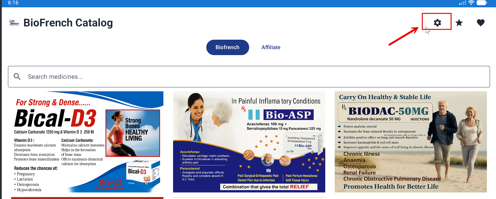
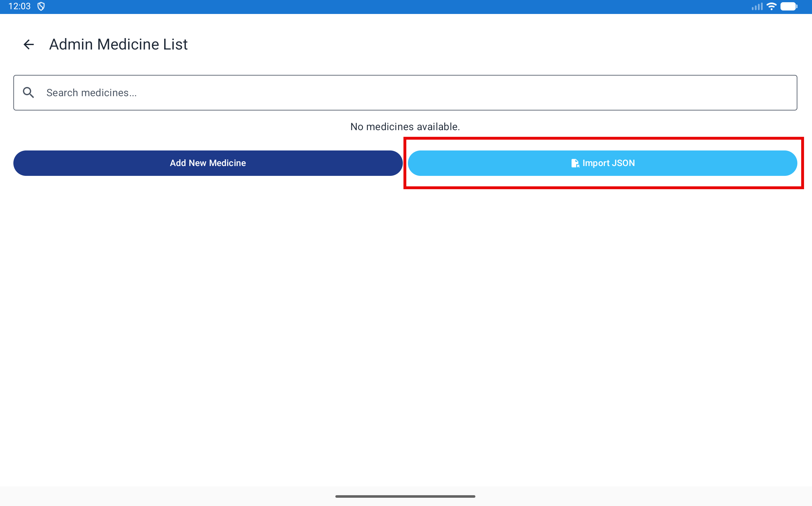
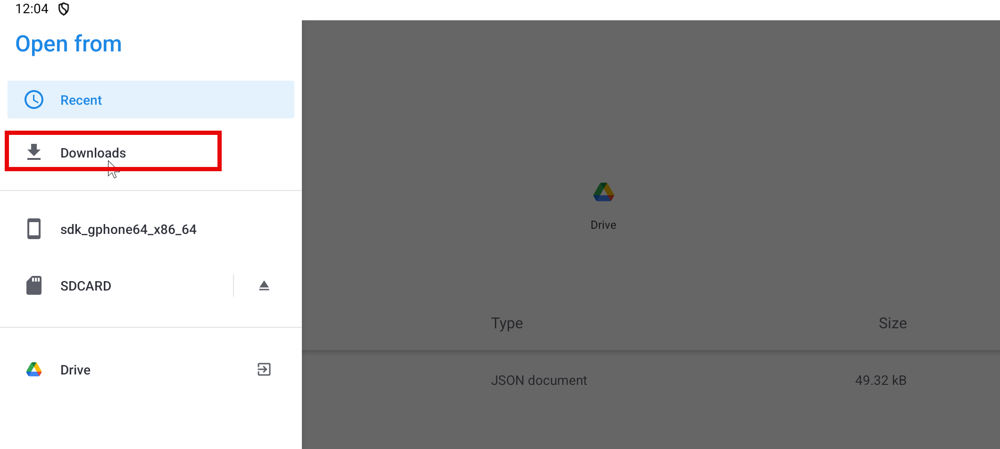
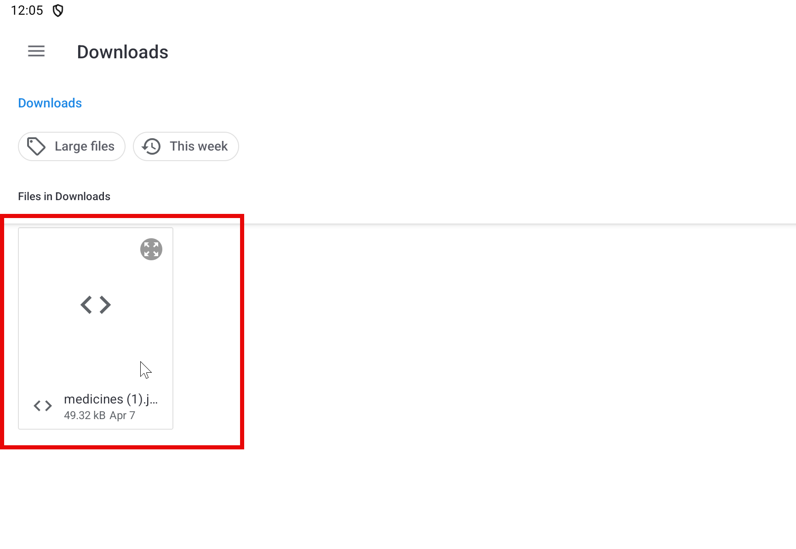
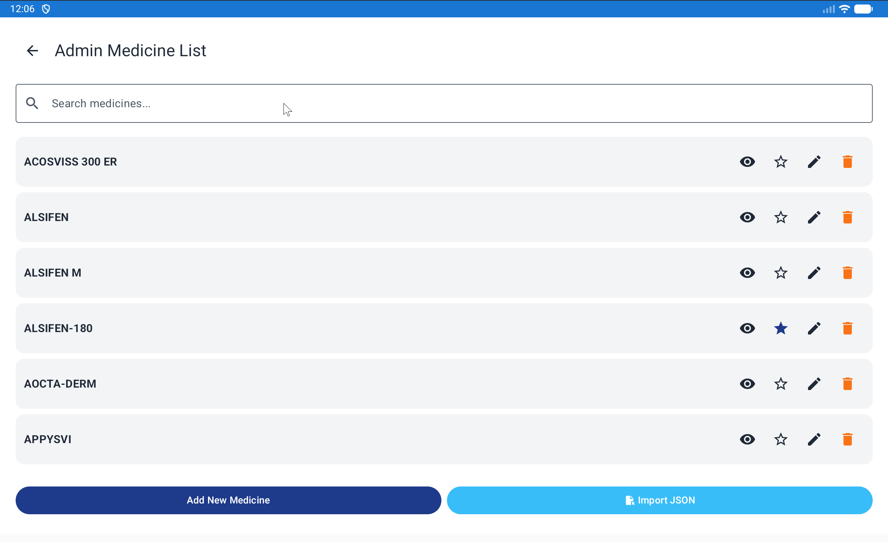
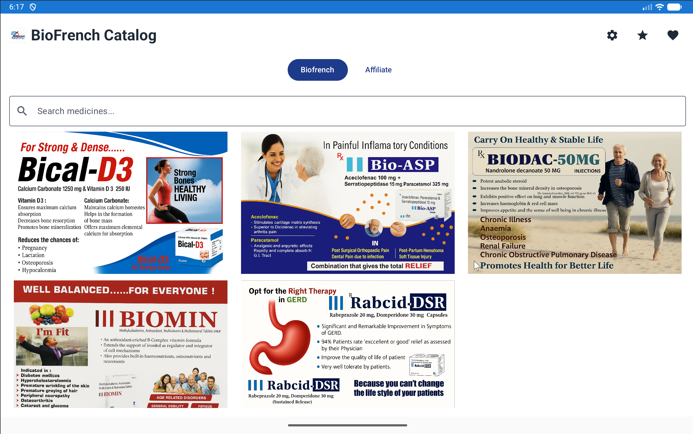

# Import medicines from a JSON file (with images)

This guide walks you through importing medicines into **BioFrench** using a **JSON** file. You can also import **images** (optional).

> **Audience:** End users (non-developers)

---

## Before you start

- Save your JSON file somewhere easy to find (for example, **Downloads**).
- If you are importing images too, make sure the images are in a folder you can easily select.

---

## Import step-by-step

### 1) Open the import screen

1. Open the app.
2. Click **Settings**.

   

3. Click **Import JSON**.

   

---

### 2) Select your JSON file

1. Choose the folder where your file is saved (example: **Downloads**).

   

2. Select your JSON file (for example **Medicine.json**).

   > Tip: If you have multiple files, pick the **latest** one.

   

---

### 3) Confirm the import worked

1. After importing, verify that the medicines appear in the app.

   

   

---

## If images don’t show up

Try these checks:

- **Confirm you selected the right folder/files.**
- **Check the file extension:** `.jpg` vs `.jpeg` vs `.png`.
- **Check capitalization:** `Paracetamol.jpg` is different from `paracetamol.jpg` on some systems.
